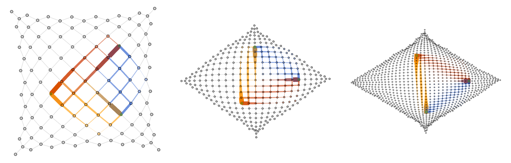

> ⚠️ **Experimental research code.** The language and API are actively developing.

# 📐 Infrageometry

This repository contains experimental code and a developing language for geometry emerging as an effective description of large graphs at a large observer scale, aligned with the vision of [Stephen Wolfram](https://writings.stephenwolfram.com/).



Our goal is to demonstrate how **Euclidean, Riemannian, and symplectic geometry** emerge in limits of graphs. We view a graph as a webbing of paths and seek the essence of geometry in this webbing. An essential element is an observer who determines properties of the observed geometry.

The eventual goal of infrageometry is to explain the emergence of space in hypergraph rewriting models of the universe, as described in the [Wolfram Physics Project technical introduction](https://www.wolframphysics.org/technical-introduction/). Note that hyperedges are not needed to recover the classical geometries.

## 🧩 From subdivision to aggregation

Classical geometry assumes the possibility of infinite subdivision at every scale. This idealization gives us ideally thin objects. Infinitesimality leads to linearity and the possibility of storing geometric information in linear objects. Uniqueness plays a central role in constructions. An indivisible minimal unit — an edge — instead gives us "puffed" or multi-valued objects, multi-valued constructions, and aggregated measurements normalized by the scale.

The language must therefore change. We want to develop it from basic constructions and measurements, following the foundational spirit of Euclid, Riemann, and Hamilton. The aim is to deduce and design a geometric language native to graphs with suitable natural minimal models, and to understand when its classical counterparts emerge.

## 📏 Synthetic (Euclidean) Infrageometry

Synthetic Infrageometry studies the moduli spaces of synthetic objects on arbitrary graph substrates, their mutual relations, and iterative constructions with them. Its goal is to demonstrate the emergence of configurations of idealized objects, including those of Euclidean geometry.

Without infinitesimality, a construction need not have a unique result. We therefore work with multi-constructions: a fixed sequence of construction steps generates a multiway system that branches at each non-unique choice but is causally invariant in the sense that the dependence graph of construction steps is the same across branches.

To each multi-object we associate a vertex density, given by normalized occupation counts over its possible realizations. Under suitable refinement and rescaling, we aim for these densities, interpreted as measures, to converge weakly to measures supported on classical thin objects.

## 🌐 Riemannian Infrageometry

Riemannian Infrageometry studies the graph substrate itself. Riemann described curve length in an n-manifold, which for him was an infinitesimal webbing of paths, using a symmetric metric tensor. On a graph, we begin with measurements at a chosen observer scale: volumes of synthetic objects based at a point, distributions of distances between points, and dimension estimates from ball covering numbers or maximal orthogonal systems. We also propose graph analogues of the metric tensor and Levi-Civita connection. We ask whether, and under what assumptions, these measurements and structures converge to their continuous counterparts along sequences of graphs.

## 🌀 Symplectic Infrageometry

Our starting point in symplectic geometry is the pairing of momentum with infinitesimal displacement. Integrating this pairing along a path gives the abbreviated action. In infrageometry, cotangent data at a point p are represented by inward-pointing rays of length r. We also have the notion of a cotangent bundle at scale r and a canonical one-form. We plan to derive dynamics of paths through an action principle and study how Hamiltonian and symplectic descriptions emerge in the limit.

## 🌱 Infrafibrations

We have the notion of fibered graphs, including constructions of tangent and cotangent bundles. These consist of outward- and inward-oriented rays, respectively. The displacement bundle consists of their endpoints, and fibers can be identified with spray graphs at the point. We study fibrations, continuous sections, and connections at scale r, including the canonical one-form and the Levi-Civita connection.

## 🕸️ Infratopology

Infratopology studies global observer-dependent graph properties. We have the ball intersection complex at scale r and intersection order k. At k = 2, the pairwise-intersection condition gives the Vietoris–Rips complex; at k = ∞, the common-intersection condition gives the Čech complex of the ball covering.
We also have notions of boundary.

## ∫ Infraanalysis

Infraanalysis develops several forms of aggregation on directed acyclic graphs (DAGs), viewed as fibered graphs over a path graph, together with corresponding derivatives satisfying a fundamental theorem of calculus. Some of these derivatives are nonlocal. We define several methods for coordinatizing a graph, leading to multivariate calculus.

## 🎯 Infraconvergence

We build minimal models on graph substrates and test their predictions by comparing measurable quantities along sequences of pointed metric measure spaces converging in the pointed measured Gromov–Hausdorff sense.
The central question is which graph constructions and observables converge to the intended geometric objects and quantities, and which assumptions on the substrates, measures, and observer scales make this possible.

## ✨ Usage

Install from the Wolfram Cloud:

```wolfram
PacletInstall["https://www.wolframcloud.com/obj/hajek_pavel/InfraGeometry.paclet", ForceVersionInstall -> True]
Needs["WolframInstitute`InfraGeometry`"]
```

Explore the [research documentation](https://www.wolframcloud.com/obj/hajek_pavel/DeployedResources/Paclet/WolframInstitute/InfraGeometry).

## ⚖️ License

Code: [MIT](https://opensource.org/license/mit). Ideas: [CC BY 4.0](https://creativecommons.org/licenses/by/4.0/).
